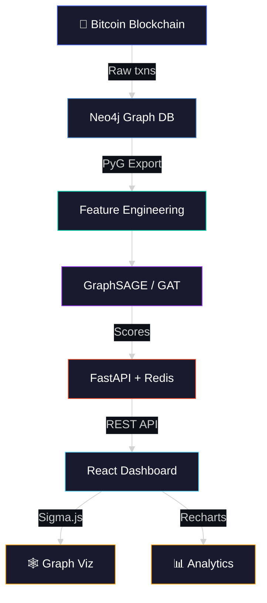
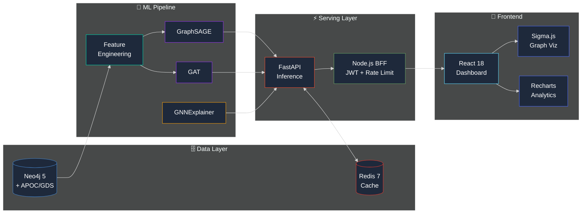

<div align="center">

<!-- Animated Header Banner -->


<!-- Animated Typing SVG -->
<a href="https://github.com/SKYLINE217/On-Chain-Fraud-Detection-System">
  
</a>

<br/>

<!-- Badges Row 1 — Status -->


<br/>

<!-- Badges Row 2 — Quick Links -->
[](docs/architecture.md)
[](docs/runbook.md)
[](docs/data_dictionary.md)
[](docs/model_card.md)
[](docs/eval_report.md)

</div>

---

> [!CAUTION]
> **Compliance Disclaimer** — This system is a **research and portfolio demonstration only**. It is NOT a certified AML/CFT compliance tool, a regulated financial product, or a legally defensible fraud-detection system. It must not be used for regulatory reporting, enforcement decisions, or any purpose requiring compliance with financial regulations (BSA, FinCEN, EU AMLD, or equivalent). The authors disclaim all liability for any such use.

---

## 🌐 Overview

<table>
<tr>
<td width="60%">

A production-grade **Graph Neural Network** pipeline for detecting illicit Bitcoin transactions, built on the [Elliptic Bitcoin Transaction Dataset](https://www.kaggle.com/datasets/ellipticco/elliptic-data-set).

The system ingests raw transaction graphs into **Neo4j**, engineers temporal & structural features, trains **GraphSAGE** and **GAT** models with **PyTorch Geometric**, and serves real-time risk scores through a **FastAPI** backend with **Redis** caching — all visualized in a **React 18** dashboard with interactive graph exploration.

**Key Numbers:**
| | |
|---|---|
| 🔢 **Transactions** | 203,769 nodes |
| 🔗 **Edges** | 234,355 directed BTC flows |
| ⏱️ **Temporal Snapshots** | 49 timesteps |
| 📊 **Features** | 166 raw + 8 engineered |
| ⚡ **Inference Latency** | <500ms (cached) |

</td>
<td width="40%">



</td>
</tr>
</table>

---

## 🏗️ Architecture

<div align="center">



</div>

### Tech Stack

<div align="center">

| Layer | Technology | Purpose |
|:---:|:---|:---|
| 🗄️ **Graph Store** | Neo4j 5 + APOC + GDS | Native graph storage, community detection, path queries |
| ⚡ **Cache** | Redis 7 | Sub-millisecond score caching, session store |
| 🧠 **ML Models** | PyTorch Geometric 2.5+ | GraphSAGE (primary), GAT (secondary), GNNExplainer |
| 🔬 **Explainability** | SHAP + GNNExplainer | Per-node feature attribution, subgraph explanations |
| 🚀 **API** | FastAPI + Pydantic v2 | Type-safe ML inference endpoints |
| 🛡️ **BFF** | Express.js + Helmet.js | JWT auth, rate limiting, security headers |
| 🎨 **Dashboard** | React 18 + Vite | Interactive graph viz (Sigma.js), analytics (Recharts) |
| 🐳 **Orchestration** | Docker Compose | Full-stack containerized deployment |

</div>

---

## 🧠 Models

<div align="center">

```
┌──────────────────────────────────────────────────────────────────┐
│                      MODEL HIERARCHY                             │
├──────────────────────────────────────────────────────────────────┤
│                                                                  │
│   ┌─────────────┐    ┌─────────────┐    ┌──────────────────┐    │
│   │  GraphSAGE  │    │     GAT     │    │  GNNExplainer    │    │
│   │  (Primary)  │    │ (Secondary) │    │  (Interpret.)    │    │
│   ├─────────────┤    ├─────────────┤    ├──────────────────┤    │
│   │ Inductive   │    │ Attention   │    │ Subgraph masks   │    │
│   │ 2-layer     │    │ Multi-head  │    │ Feature attrib.  │    │
│   │ Mean agg.   │    │ 8 heads     │    │ SHAP values      │    │
│   └──────┬──────┘    └──────┬──────┘    └────────┬─────────┘    │
│          │                  │                     │              │
│          └──────────┬───────┘                     │              │
│                     ▼                             │              │
│            ┌────────────────┐                     │              │
│            │  Risk Score    │◄────────────────────┘              │
│            │  [0.0 — 1.0]  │                                    │
│            └────────────────┘                                    │
│                                                                  │
│   ┌─────────────────────────────────────────────────────────┐   │
│   │  BASELINES: Logistic Reg. │ Random Forest │ XGBoost     │   │
│   └─────────────────────────────────────────────────────────┘   │
│                                                                  │
└──────────────────────────────────────────────────────────────────┘
```

</div>

> [!NOTE]
> XGBoost / Random Forest may match or exceed GNN PR-AUC on this dataset (consistent with published Elliptic literature). The GNN advantage is **inductive generalization** to unseen nodes at inference time, not necessarily higher static PR-AUC.

---

## 🚀 Quick Start

<details>
<summary><b>📋 Prerequisites</b></summary>
<br/>

- **Docker Desktop** (for Neo4j + Redis containers)
- **Python 3.11+** with `pip`
- **Node.js 18+** with `npm`
- **Kaggle CLI** (`pip install kaggle`) with API key configured

</details>

```bash
# ─────────────────────────────────────────────────
# 1 │ Clone & Configure
# ─────────────────────────────────────────────────
git clone https://github.com/SKYLINE217/On-Chain-Fraud-Detection-System.git
cd On-Chain-Fraud-Detection-System
cp .env.example .env          # ← Fill in your secrets

# ─────────────────────────────────────────────────
# 2 │ Start Infrastructure
# ─────────────────────────────────────────────────
docker compose up neo4j redis -d

# ─────────────────────────────────────────────────
# 3 │ Download Elliptic Dataset
# ─────────────────────────────────────────────────
bash scripts/download_elliptic.sh

# ─────────────────────────────────────────────────
# 4 │ ETL + Feature Engineering
# ─────────────────────────────────────────────────
python src/etl/load_neo4j.py
python src/features/engineer.py
python src/features/build_pyg.py

# ─────────────────────────────────────────────────
# 5 │ Launch API + Dashboard
# ─────────────────────────────────────────────────
docker compose up fastapi bff -d

# ─────────────────────────────────────────────────
# 6 │ Open Dashboard  🎉
# ─────────────────────────────────────────────────
open http://localhost:3000
```

> [!TIP]
> See the full [Runbook](docs/runbook.md) for cold-start troubleshooting, batch scoring, and production deployment notes.

---

## 📂 Project Structure

```
On-Chain-Fraud-Detection-System/
│
├── 🔌 api/                         # FastAPI Serving Layer
│   ├── main.py                     #   App factory + CORS/auth middleware
│   ├── deps.py                     #   Neo4j / Redis dependency injection
│   ├── middleware/auth.py          #   API key verification guard
│   ├── models/                     #   Pydantic v2 request/response schemas
│   └── routers/                    #   /wallet, /cluster, /health endpoints
│
├── 🧠 src/                         # ML Pipeline
│   ├── etl/load_neo4j.py          #   Idempotent Elliptic → Neo4j loader
│   ├── features/                   #   Feature engineering + PyG graph builder
│   ├── models/                     #   GraphSAGE & GAT model definitions
│   └── serving/                    #   Batch scoring pipeline
│
├── 🎨 frontend/                    # React 18 Dashboard
│   └── client/                     #   Vite + Sigma.js + Recharts + Zustand
│
├── 📜 scripts/                     # Automation Scripts
│   ├── download_elliptic.sh        #   Dataset download + inflate
│   └── validate_scores.py          #   Score distribution sanity checks
│
├── 🧪 tests/                       # Test Suite
│   └── load_tests/                 #   Locust-based API load tests
│
├── 📚 docs/                        # Documentation
│   ├── architecture.md             #   System design + service diagram
│   ├── runbook.md                  #   Operations guide
│   ├── data_dictionary.md          #   Node/edge property schemas
│   ├── model_card.md               #   Model card (limitations, biases)
│   └── eval_report.md              #   Evaluation metrics + analysis
│
├── 🐳 docker-compose.yml          # Service Orchestration
├── 📦 requirements.txt            # Python 3.11 dependencies
└── 📄 .env.example                # Environment variable template
```

---

## 🔌 API Reference

<div align="center">

| Method | Endpoint | Description | Cache |
|:---:|:---|:---|:---:|
| `GET` | `/wallet/{address}` | Risk score + metadata lookup | ✅ Redis |
| `GET` | `/wallet/{address}/subgraph` | 2-hop neighborhood (max 200 nodes) | ✅ Redis |
| `GET` | `/wallet/path/find?src=...&dst=...` | Shortest path between addresses (≤10 hops) | ❌ |
| `GET` | `/cluster/list` | Top communities ranked by avg risk | ✅ Redis |
| `GET` | `/cluster/{id}` | Community detail with top 20 wallets | ✅ Redis |
| `POST` | `/explain/{address}` | GNNExplainer subgraph + SHAP attribution | ❌ |
| `GET` | `/health` | Liveness probe (Neo4j + Redis connectivity) | ❌ |

</div>

<details>
<summary><b>📡 Example: Wallet Risk Lookup</b></summary>

```bash
curl -H "X-API-Key: $API_KEY" http://localhost:8000/wallet/0xabc123

# Response:
{
  "address": "0xabc123",
  "risk_score": 0.87,
  "predicted_label": "illicit",
  "confidence": 0.873,
  "community_id": 1847,
  "time_step": 42,
  "top_features": [
    {"feature": "burst_score", "shap_value": 0.342},
    {"feature": "tx_freq", "shap_value": 0.221}
  ]
}
```

</details>

<details>
<summary><b>🧠 Example: GNNExplainer</b></summary>

```bash
curl -X POST -H "X-API-Key: $API_KEY" http://localhost:8000/explain/0xabc123

# Response:
{
  "target_node": "0xabc123",
  "subgraph": {
    "nodes": [...],
    "edges": [...],
    "importance_scores": [...]
  },
  "rationale": "Flagged due to: High burst_score (8.7, +0.342 SHAP); Connected to 2 illicit nodes in community #1847."
}
```

</details>

---

## 📊 Key Metrics

<div align="center">

| Metric | Target | Status |
|:---|:---|:---:|
| **Primary Metric** | PR-AUC (illicit class) | 🎯 |
| **Temporal Split** | Train ≤34 / Val 35–39 / Test ≥40 | ✅ |
| **Latency p50** `/wallet` | <500ms (cached) | ⚡ |
| **Latency p95** `/wallet` | <5000ms | ⚡ |
| **Scale Validation** | 10M+ edges (synthetic inflation) | 📈 |
| **Feature Dimensions** | 166 raw + 8 engineered = 174 | ✅ |

</div>

> [!IMPORTANT]
> ROC-AUC is optimistic under ~2% class imbalance. This project always reports **PR-AUC** alongside ROC-AUC for honest evaluation. See the full [Eval Report](docs/eval_report.md) for details.

---

## 📚 Documentation

| Document | Description |
|:---|:---|
| 📐 [Architecture](docs/architecture.md) | System design, service diagram, data flow |
| 📖 [Runbook](docs/runbook.md) | Cold start, batch job scheduling, troubleshooting |
| 📊 [Data Dictionary](docs/data_dictionary.md) | All node/edge properties, graph schemas |
| 🧠 [Model Card](docs/model_card.md) | Model architecture, limitations, ethical considerations |
| 📈 [Eval Report](docs/eval_report.md) | Evaluation metrics, PR curves, temporal analysis |
| 🎬 [Demo Notes](docs/demo_notes.md) | Live demo walkthrough & talking points |

---

## 🛡️ Security & Auth

```
┌──────────────┐     ┌──────────────┐     ┌──────────────┐
│   Client     │────▶│   BFF        │────▶│   FastAPI    │
│   (React)    │     │   (Express)  │     │   (Python)   │
└──────────────┘     └──────────────┘     └──────────────┘
                      │ JWT Auth     │     │ API Key      │
                      │ Rate Limit   │     │ Pydantic     │
                      │ Helmet.js    │     │ CORS         │
                      │ HTTPS Only   │     │ Validation   │
```

---

## 🤝 Contributing

This is a portfolio project. If you have suggestions or find issues:

1. **Fork** the repository
2. Create a feature branch (`git checkout -b feat/amazing-improvement`)
3. Commit your changes (`git commit -m 'feat: add amazing improvement'`)
4. Push to the branch (`git push origin feat/amazing-improvement`)
5. Open a **Pull Request**

---

## 📄 License

This project is for **research and portfolio demonstration purposes only**.

---

<div align="center">


<br/>

**Built with** 🧠 **by [SKYLINE217](https://github.com/SKYLINE217)**

<br/>


</div>
